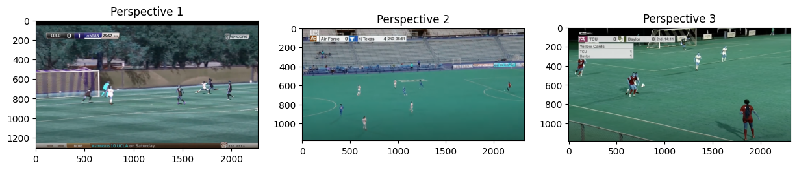

__End-to-end modular components for soccer footage analytics__

<!-- 

 -->

# Highlights 
## Field Isolation 
Isolating the field in a frame for the purposes of ROI minimization used as a preprocessing step or context specification. 

> Useful for contextual masking and improving accuracy of vision models downstream.  

|Demo&nbsp;&nbsp;&nbsp;&nbsp;&nbsp;&nbsp;&nbsp;&nbsp;&nbsp;&nbsp;&nbsp;&nbsp;&nbsp;&nbsp;&nbsp;&nbsp;&nbsp;&nbsp;&nbsp;&nbsp;&nbsp;&nbsp;&nbsp;&nbsp;&nbsp;&nbsp;&nbsp;&nbsp;&nbsp;&nbsp;&nbsp;&nbsp;&nbsp;&nbsp;&nbsp;&nbsp;&nbsp;&nbsp;&nbsp;&nbsp;&nbsp;&nbsp;&nbsp;&nbsp;&nbsp;&nbsp;&nbsp;|Training/Build|Inference/Pipeline Definition|Description|
|-|-|-|-|
| Created using custom annotated [Bundesliga Dataset](https://www.kaggle.com/competitions/dfl-bundesliga-data-shootout)|[field_isolation_fpn](https://github.com/tigboatnc/soccerEye/blob/main//experiments/fpn-1_training_colab.ipynb)|[field_isolation_FPN...](https://github.com/tigboatnc/soccerEye/blob/main/experiments/field_isolation_FPN_FieldMask_1_INFERENCEVIDEO.ipynb)|FPN + Resnet 34 backbone custom trained field isolation, __creates masks at 256x256__.     `relatively fast cpu inference`|
| |[field_isolation_pixelation](https://github.com/tigboatnc/soccerEye/blob/main/experiments/field_isolation_cv.ipynb)|[methods.P_IF_3](https://github.com/tigboatnc/soccerEye/blob/main/methods.py)|Pixelation -> Adaptive Color Normalization -> Thresholding based pipeline for field isolation, __creates masks at original size__.  `less accurate but  faster than NN based methods`|

## Field Parameter Estimation 
Analysing videos and for each still frame, finding out the field parameters with respect to the current frame and the full field. 
> Useful preprocessing step for 3D->2D translation and statistics based on field locations. 

|Demo&nbsp;&nbsp;&nbsp;&nbsp;&nbsp;&nbsp;&nbsp;&nbsp;&nbsp;&nbsp;&nbsp;&nbsp;&nbsp;&nbsp;&nbsp;&nbsp;&nbsp;&nbsp;&nbsp;&nbsp;&nbsp;&nbsp;&nbsp;&nbsp;&nbsp;&nbsp;&nbsp;&nbsp;&nbsp;&nbsp;&nbsp;&nbsp;&nbsp;&nbsp;&nbsp;&nbsp;&nbsp;&nbsp;&nbsp;&nbsp;&nbsp;&nbsp;&nbsp;&nbsp;&nbsp;&nbsp;&nbsp;|Training/Build|Inference/Pipeline Definition|Description|
|-|-|-|-|
||[field_parameter_lines](https://github.com/tigboatnc/soccerEye/blob/main/experiments/field_parameter_lines.ipynb)|-|Detecting bounds w.r.t the current frame|

## Player Identification and Tracking 
Identifying soccer players within the field and tracking target players, methods for both still frames and dynamic frames including reidentification methods. 

> Useful for analyzing tendencies, specially when tracked with the context of ball location. 

|Demo&nbsp;&nbsp;&nbsp;&nbsp;&nbsp;&nbsp;&nbsp;&nbsp;&nbsp;&nbsp;&nbsp;&nbsp;&nbsp;&nbsp;&nbsp;&nbsp;&nbsp;&nbsp;&nbsp;&nbsp;&nbsp;&nbsp;&nbsp;&nbsp;&nbsp;&nbsp;&nbsp;&nbsp;&nbsp;&nbsp;&nbsp;&nbsp;&nbsp;&nbsp;&nbsp;&nbsp;&nbsp;&nbsp;&nbsp;&nbsp;&nbsp;&nbsp;&nbsp;&nbsp;&nbsp;&nbsp;&nbsp;|Training/Build|Inference/Pipeline Definition|Description|
|-|-|-|-|
||-|[Tracking using Multi Instance Learner ](https://github.com/tigboatnc/soccerEye/blob/main/experiments/tracking-intro.py)|Using Multi Instance Learner in contrib for player tracking   `Only usable in still frame` |

extras.ipynb

# Project Goals
- Compatible with televised game footage (dynamically shifting frames)
- Should work with static full field frames + Dynamic occluded frames

# Checkpoints + Feature List 
## Tooling 
- [x] Field Localization `FL`
    - Locating the field in a frame 
- [ ] Player Identification + Localization `PL`
    - Identifying player by jersy numbers 
    - Localization of players on the field 
- [ ] Ball Identification + Localization `BL`
    - Identifying and localizing soccer ball in the field 

## Analytics 
- [ ] 2D Birds Eye View 
    - Converting the footage to birds eye view with players and ball mapped 
- [ ] Penalty Analyzer 
    - Analyze penalty shootouts 
        - Ball Curvature 
        - Ball Speed 
        - Shooter Pose 
- [ ] Pattern Crunching 
    - Given a few games of a team, pattern and play recognition for any given team and good counter-patterns. 
    - Analysing attack patterns of teams. 
- [ ] Player Analysis 
    - Discovering player patterns (passing left, right etc.) and biases for building counter patterns. 
- [ ] Shooting Hotspots
    - Determining best placements for succesful shotmaking against specific teams. 
    - Based on advancing ideas as worked on [here](https://github.com/danielazevedo/Football-Analytics/blob/master/expected_goals/xG_model_SVM.ipynb)

# Requirements 
- OpenCV 
- Scikit-Image 
- PyTorch 
- TensorFlow

# Domain Description 

Useful in understanding the challenges faced in the field of sports analytics and visualizing edge cases. 

__Background Variations__ 

__Angle Variations__ 

__Feed Specific Variations__ 

# Extras
## Resources, References, Credits. 
- [DevTo/Stephan007](https://dev.to/stephan007/open-source-sports-video-analysis-using-maching-learning-2ag4)
- [PyImageSearch](https://pyimagesearch.com/blog/)
- [Kaggle Bundesliga Dataset](https://www.kaggle.com/competitions/dfl-bundesliga-data-shootout)
- [SoccerNet](https://www.soccer-net.org)
- [Ransac Good Read](https://sdg002.github.io/ransac-circle/index.html)
